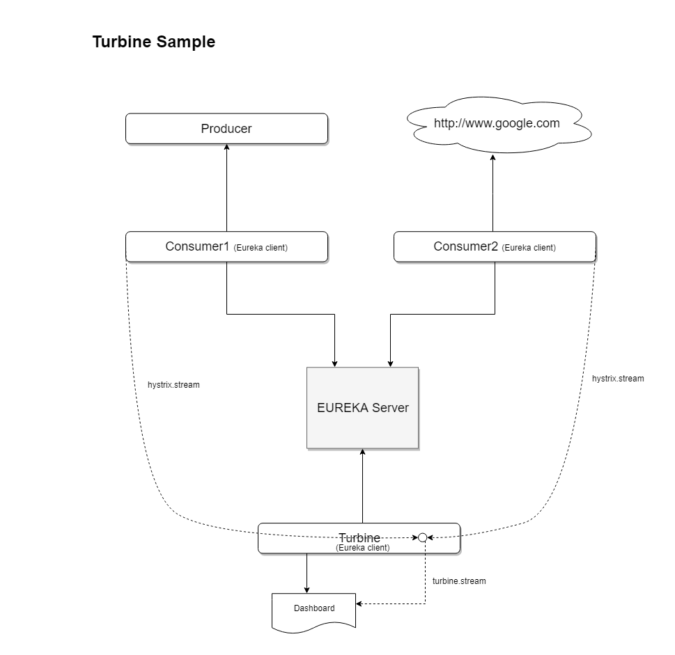

Netflix Turbine aggregates multiple Hystrix Metrics Streams into one, so that it could be displayed into a single dashboard view. 

In our example Consumer1 and Consumer2 use Hystrix circuit breaker and expose Hystrix Metrics Stream at "hystrix.stream" endpoints. For the Turbine to discover these endpoints automatically EUREKA Service discovery is used, in which Consumer1, Consumer2 and Turbine act as Eureka clients and registered to an EUREKA Server. The Turbine collects all the available Hystrix Metrics Streams and outputs one aggregated stream named "turbine.stream".

